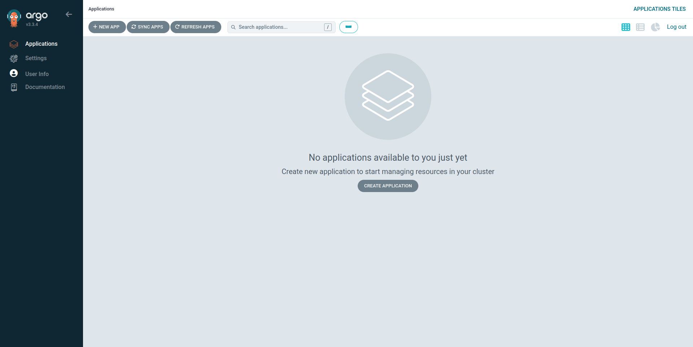
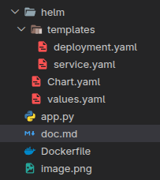
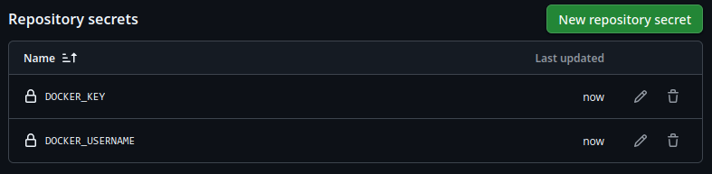
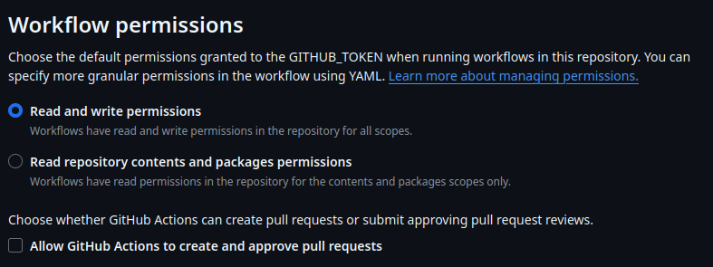
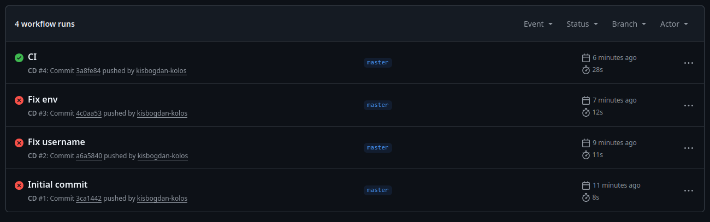
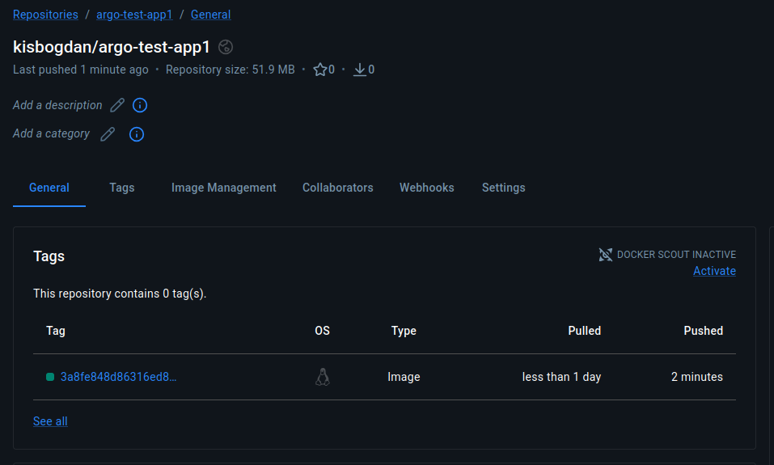
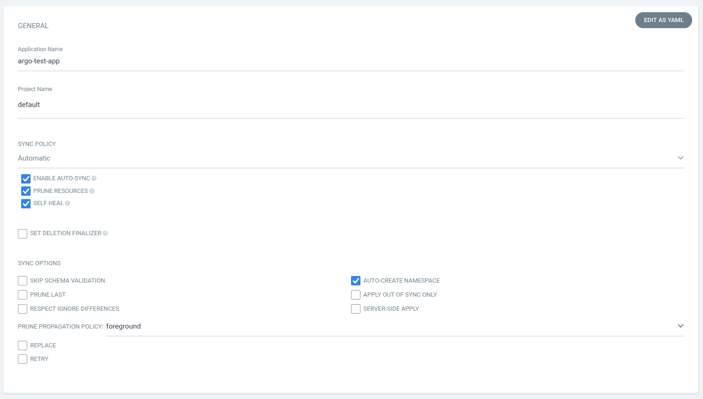
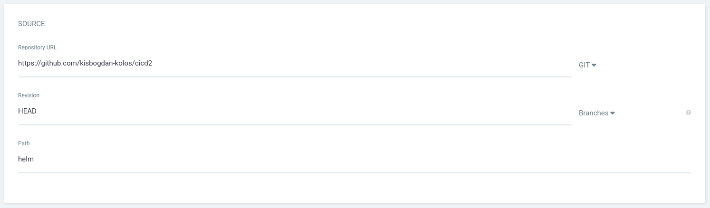
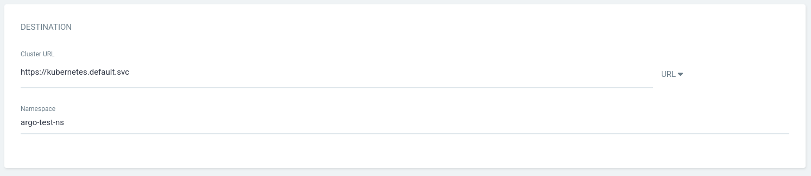

# Felhők hálózati szolgáltatásai laboratórium - CI/CD 2. labor

## Kis-Bogdán Kolos - `OQ255W`

## Előkészletek

Már volt minikube a gépemen, és GitHub és DockerHub fiókjaim is voltak.

A leírás alapján feltelepítettem az ArgoCD-t a minikube-ba.

A webes felület egy kis idő után elérhetővé is vált.



## Helm

Létrehoztam a kért fájlokat és a mappaszerkezetet:



A `deploy.yaml`-ben átírtam a Docker image-et a sajátomra.

## GitHub actions

Létrehoztam a kért `cd.yaml` fájlt, és bemásoltam a tartalmát a leírásból.

## Feltöltés

Létrehoztam a [DockerHub](https://hub.docker.com/repository/docker/kisbogdan/argo-test-app1/general)-on és a [GitHub](https://github.com/kisbogdan-kolos/cicd2)-on is a projektet.

Majd összelinkeltem a lokális git repót.

```bash
git remote add origin git@github.com:kisbogdan-kolos/cicd2.git
```

Ezután beállítottam a GitHub-os környezeti változókat:



```bash
git push --set-upstream origin master
```

A repo-ban még be kellett kapcsolni, hogy a GitHub actions bot tudjon szerkeszteni is, és ne csak olvasni.



Ezután némi szenvedés árán már ment a CI, és fent is volt a Docker image a DockerHub-on.





## Deploy

A leírás alapján elkészítettem az új appot:






